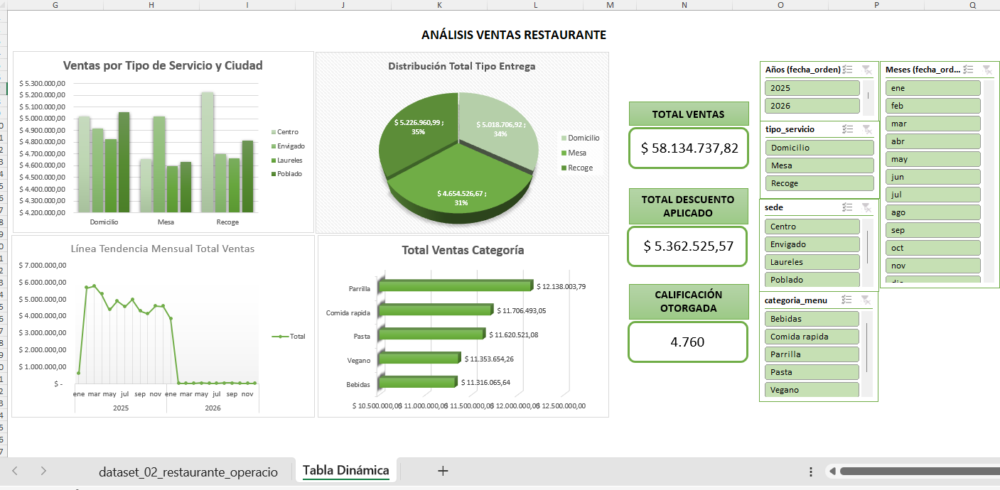

# Dashboard ventas restaurante
Dashboard desarrollado en Microsoft Excel para analizar el desempeño operativo y comercial de un restaurante a través de tablas dinámicas, gráficos y segmentadores; permitiendo realizar un análisis fundamentado en registros e información que valide la toma de decisiones con propósito, brindando un enfoque transversal a través de los registros procesados.

## Dashboard

## Objetivo
✔ Analizar ventas
✔ Evaluar sedes
✔ Comparar categorías
✔ Identificar tendencias

## Dataset
El dataset registra información operativa de pedidos, ventas por sede, categorías, fecha y variables correlacionadas.

| Variable    | Tipo    |
| ----------- | ------- |
| Orden       | Texto   |
| Fecha       | Fecha   |
| Hora        | Hora    |
| Sede        | Texto   |
| Categoría   | Texto   |
| Cantidad    | Número  |
| Valor Bruto | Decimal |

## Tratamiento de datos
✔ Validación del formato de fechas y horas.
✔ Conversión de valores monetarios.
✔ Revisión de registros duplicados.
✔ Limpieza de espacios y caracteres especiales.
✔ Validación de registros nulos.
✔ Estandarización de categorías.
✔ Revisión de estadísticas descriptivas (promedio, mediana y moda).
✔ Dashboard.

## Visualizaciones
- Ventas por ciudad.
- Ventas por tipo de servicio.
- Distribución por tipo de entrega.
- Tendencia mensual.
- Ventas por categoría.
- Indicadores generales de ventas, descuentos y calificación.
- KPIs
- Total ventas
- Total descuentos
- Calificación promedio
- Ventas por categoría
- Ventas por sede
- Ventas por servicio
- Tecnologías utilizadas
- Microsoft Excel
- Tablas dinámicas
- Segmentadores
- Gráficos dinámicos
- Funciones de Excel
