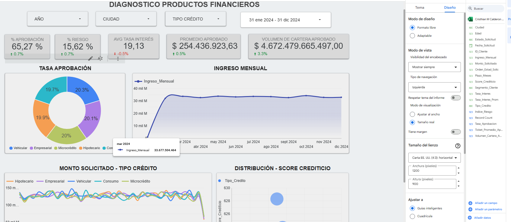

# Tablero de análisis ejecutivo entidades financieras

Dashboard ejecutivo desarrollado en Looker Studio para visualizar indicadores relacionados con la gestión de solicitudes de crédito y el comportamiento de la cartera de los clientes, analizando variables referentes como asignación de montos, perfil del cliente, puntaje crediticio, volumen de cartera general e indicadores claves para determinar el comportamiento dado y a través de las segmentaciones dar lugar a proyección y situaciones establecidas de mejora a futuro.

## Objetivo

Construir un tablero interactivo que facilite el seguimiento de indicadores financieros y comerciales asociados al proceso de aprobación de créditos.

## Dataset

El conjunto de datos contiene información de clientes y solicitudes de crédito.

## Variables identificadas dentro del análisis
✔ ID Cliente
✔ Edad
✔ Ciudad
✔ Ingreso Mensual
✔ Tipo de Crédito
✔ Monto Solicitado
✔ Tasa de Interés
✔ Plazo
✔ Estado de Solicitud
✔ Segmento
✔ Score Crediticio
✔ Fecha de Solicitud
✔ Proceso ETL

## Procesos integrados
- Validación de tipos de datos.
- Conversión de fechas.
- Normalización de campos categóricos.
- Revisión de registros duplicados.
- Validación de nulos y espacios en blanco.
- Limpieza de caracteres especiales.
- Verificación de consistencia entre variables.
- Análisis descriptivo de variables numéricas mediante promedio, mediana y moda.
- Dashboard

## Indicadores analizados y establecidos
- Indicadores generales de aprobación.
- Riesgo promedio.
- Tasa de interés promedio.
- Volumen de cartera.
- Evolución mensual.
- Distribución por tipo de crédito.
- Relación entre monto solicitado y score crediticio.
- KPIs
- % Aprobación
- % Riesgo
- Tasa promedio
- Promedio aprobado
- Volumen de cartera
- Ingreso mensual
- Tecnologías utilizadas
- Looker Studio
- Google Sheets / Excel
- Campos calculados
- Filtros interactivos

